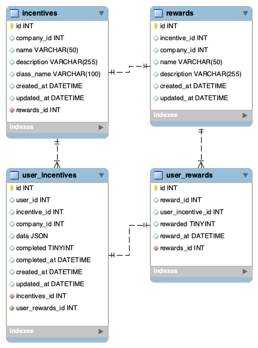

# Ovia Backend Engineering Exercise

## Feature Planning

### Incentive System Process Flowchart

The following Design Flowchart illustrates the initial concept of how the Incentive System might work.
This design takes advantage of the following design patterns to accomplish the proposed functionality
while maintaining code clarity and separation of concerns:

* Service Oriented Architecture
* Event Driven Architecture
* Adapter/Interface Pattern

[Click Here to View Incentive System Design Flowchart](https://whimsical.com/ovia-incentives-feature-V1XeSrEHQEK3m3gkEb8VhQ)

### Code Flow

1. User performs an incentive action, which is stored in the `user_incentives` table
2. A Model Observer listens for created and updated Model Events
3. Model Events are fired, and Incentive Service is used to process the Incentive Data
4. If an Incentive is processed and is deemed Complete, the `user_incentives` table is updated, and the Incentive Complete Event is fired
5. Any active Incentive Complete Event Listeners execute and perform necessary actions

### Caching

To increase performance, we can use caching for Incentive API routes. This would mean that direct database
calls would not be needed when clients hit our API. In general, an exceptionally high level of 
consistency "should" not be needed here (assumption), so delays in cache invalidation and/or 
rebuild are likely acceptable.

Caching can be accomplished in the following manner:

* There is a command which will build the User Incentive cache
* This command can be used to warm and rebuild the cache as needed, and
* This command can be run at a given interval using the job schedule (ie. cron), and/or
* This command can also be added to our Model Observer methods to rebuild the cache whenever inserts/updates occur

### Incentives Tables Design Diagram

The Diagram below represents the initial table design needed to implement the Incentives feature. The tables shown represent only the new tables needed, not the entirety of the database design.



#### Incentive Data

Incentive data will be stored as a JSON object, which will allow each Incentive to 
have its own specific data model, without the need to constantly modify any tables, fields, etc.

#### Example Incentive Data

Birth Record:
```json
{
    "birth_date": "2021-09-15 15:30:00",
    "date": "2021-09-15 17:15:00"
}
```

Heath Data Log:
```json
[
    {
        "data": [
            {
              "type": "mood",
              "value": "happy"
            },{
              "type": "symptom",
              "value": "cough"
            }
        ],
        "date": "2021-09-15 17:15:00"
    },{
        "data": [
            {
                "type": "mood",
                "value": "tired"
            }
        ],
        "date": "2021-09-14 22:22:00"
    }
]
```

### Data Sharing with External Systems

Assuming there's an existing client-side API in place, we would simply extend the API so that this new incentive
data is accessible via the API. Potential API endpoints could be constructed as follows:

`GET /user/incentives`

* Returns all incentives the User has on record, including the status and related data for each.

`GET /user/incentive/{id}`

* Returns the incentive data for the given `id`

`GET /user/rewards`

* Returns all rewards the User has won

## Additional Steps

* Writing tests for these new features
* Finish Cache command and wiring, after discussion on preferred/needed method of rebuild
* Creating new API endpoints
* etc
